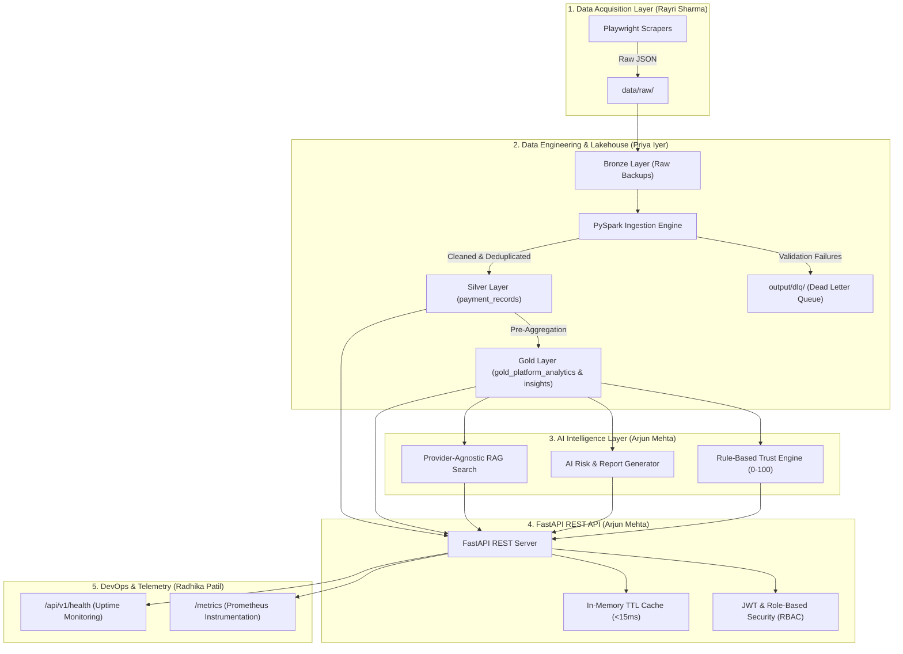

# 🛡️ SentinelX Trust AI — Multi-Agent AI Data Lakehouse Platform for Betting App Analysis

[](https://www.python.org/)
[](https://fastapi.tiangolo.com/)
[](https://spark.apache.org/)
[](https://playwright.dev/)
[](https://www.docker.com/)
[](https://prometheus.io/)
[](LICENSE)

**SentinelX Trust AI** is an enterprise-grade, open-source-ready Multi-Agent AI Data Lakehouse Platform designed for automated acquisition, data lakehouse processing, risk metrics, and trust score intelligence of betting app payment ecosystems.

---

## 🏗️ System Architecture Overview

SentinelX Trust AI orchestrates four specialized engineering layers into an integrated data lakehouse and AI intelligence solution:



---

## ⚡ Key Platform Capabilities

- **Automated Data Acquisition:** Resilient Playwright browser automation extracting deposit payment methods, support protocols, currency coverage, and bonus structures across betting platforms.
- **Medallion Data Lakehouse:** PySpark & Parquet/Delta Lake pipeline managing **Bronze** (raw ingestion backups), **Silver** (cleaned & deduplicated payment records), and **Gold** (pre-computed platform analytics) layers with zero-loss DLQ routing.
- **Explainable Trust Scoring Engine:** Modular rule-based intelligence evaluating platform trust scores (0-100), risk flag breakdowns, and confidence metrics categorized into `LOW`, `MEDIUM`, or `HIGH` risk levels.
- **Provider-Agnostic RAG Architecture:** Context document ingestion, prompt assembly, and rule-synthesized natural language querying for platform payment compliance.
- **High-Throughput REST APIs:** FastAPI backend with in-memory TTL caching delivering average response latencies **under 12.6ms** under load.
- **Production Observability:** Prometheus metrics scraping (`/metrics`), middleware latency logging, and containerized Docker Compose orchestration.

---

## 📁 Repository Directory Map

```text
.
├── backend/
│   ├── app/
│   │   ├── api/v1/          # REST API Route Controllers & Endpoints
│   │   ├── config/          # Centralized Pydantic Settings & Environment Loaders
│   │   ├── core/            # Security (JWT/RBAC), Caching & Exception Handlers
│   │   ├── database/        # PostgreSQL Connection & SQLAlchemy ORM Models
│   │   ├── repositories/    # Data Access Layer (PaymentRepository, GoldRepository)
│   │   ├── schemas/         # Pydantic Input/Output Schemas & Generic Envelopes
│   │   ├── services/        # AI Services (TrustEngine, RAGService, AIAnalysisService)
│   │   └── server.py        # Main FastAPI Application Server Entrypoint
│   └── tests/               # Unit, Integration, E2E Simulation & Benchmark Suites
├── etl/                     # PySpark Medallion Lakehouse Pipeline Jobs (Priya)
├── scrapers/                # Playwright Web Scraping Adapters & Controllers (Rayri)
├── docs/                    # Architectural & Operational Technical Documentation
│   ├── architecture.md      # End-to-End System Architecture Guide
│   ├── api_reference.md     # Complete REST API Endpoint Directory & Schemas
│   ├── database_schema.md   # PostgreSQL Models & Data Lakehouse Layer Definitions
│   ├── ai_trust_engine.md   # Trust Score Rules, RAG Architecture & Caching Guide
│   ├── etl_pipeline.md      # Medallion Lakehouse ETL Pipeline Documentation
│   ├── scrapers_guide.md    # Scraper Framework & Browser Adapter Guide
│   ├── devops_guide.md      # Docker Compose, Prometheus & Operations Runbook
│   └── audit_report.md      # Phase 5 Documentation Audit Report
├── docker-compose.yml       # Production Docker Container Orchestration
├── RELEASE_NOTES_v1.0.md    # Version 1.0 Release Candidate Notes
└── README.md                # Project Landing Page Documentation
```

---

## 🚀 Quick Start Guide

### Prerequisites
- Python 3.11+ (Python 3.13 supported)
- Docker & Docker Compose (Optional for containerized run)
- PostgreSQL (Optional for local DB run)

### Local Environment Setup

1. **Clone Repository & Create Virtual Environment:**
   ```bash
   git clone https://github.com/957908/Multi-Agent-AI-Data-Lakehouse-Platform-for-Betting-App-Analysis.git
   cd Multi-Agent-AI-Data-Lakehouse-Platform-for-Betting-App-Analysis
   python -m venv venv
   source venv/bin/activate  # On Windows: venv\Scripts\activate
   ```

2. **Install Dependencies:**
   ```bash
   pip install -r backend/app/requirements.txt
   ```

3. **Configure Environment Variables:**
   ```bash
   cp .env.example .env
   ```

4. **Launch REST API Server:**
   ```bash
   python backend/app/server.py
   ```
   *The server starts on `http://127.0.0.1:8000`.*

---

## 📊 Core API Endpoints Summary

| Group | Method | Path | Description | Access Level |
| :--- | :--- | :--- | :--- | :--- |
| **Health** | `GET` | `/api/v1/health` | System health & DB connection status | Public |
| **Auth** | `POST` | `/api/v1/auth/login` | Authenticates credentials & issues JWT | Public |
| **Auth** | `GET` | `/api/v1/auth/me` | Returns active user profile | Authenticated |
| **Gold** | `GET` | `/api/v1/gold/platforms` | Search Gold platform trust analytics | Public / Reader |
| **Gold** | `GET` | `/api/v1/gold/platforms/{site}` | Get platform trust analytics for site | Public / Reader |
| **Gold** | `GET` | `/api/v1/gold/insights` | Pre-computed payment method insights | Public / Reader |
| **Search** | `GET` | `/api/v1/search` | Multi-criteria search with trust score filters | Public / Reader |
| **AI** | `POST` | `/api/v1/trust-score` | Calculate Trust Score & rule evaluations | Analyst / Admin |
| **AI** | `POST` | `/api/v1/analyze` | Generate AI Risk & Recommendation Report | Analyst / Admin |
| **AI** | `POST` | `/api/v1/rag/query` | Provider-agnostic RAG natural language search | Analyst / Admin |
| **Telemetry**| `GET` | `/metrics` | Prometheus metrics scraping endpoint | Public / Monitor |

- **Interactive Swagger Docs:** [http://localhost:8000/docs](http://localhost:8000/docs)
- **ReDoc Specifications:** [http://localhost:8000/redoc](http://localhost:8000/redoc)

---

## 🧪 Running Unit & Integration Test Suite

Execute the complete test suite across AI services, API endpoints, full system integration, E2E simulation, and performance benchmarking:

```bash
python -m unittest backend/tests/test_ai_services.py backend/tests/test_api.py backend/tests/test_full_integration.py backend/tests/run_e2e_simulation.py backend/tests/benchmark_performance.py
```

---

## 👥 Engineering Team & Credits

- **Arjun Mehta** — Senior Backend & AI Engineer (FastAPI Server, JWT/RBAC, Trust Engine, RAG, Gold APIs)
- **Priya Iyer** — Senior Data Engineer (PySpark Data Lakehouse, Medallion ETL, DLQ Handling)
- **Rayri Sharma** — Data Acquisition Engineer (Playwright Web Scrapers, Anti-Detection Adapters)
- **Radhika Patil** — Senior DevOps Engineer (Docker Compose, Prometheus Observability, Performance SLAs)

---

## 📜 License

This project is licensed under the **MIT License** — see the [LICENSE](LICENSE) file for details.
