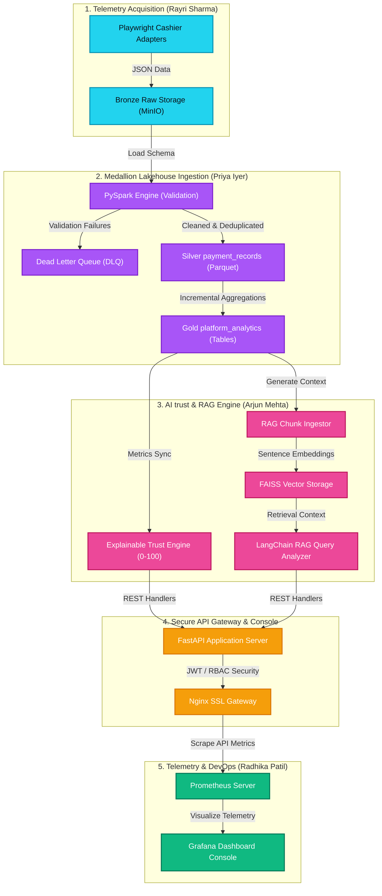
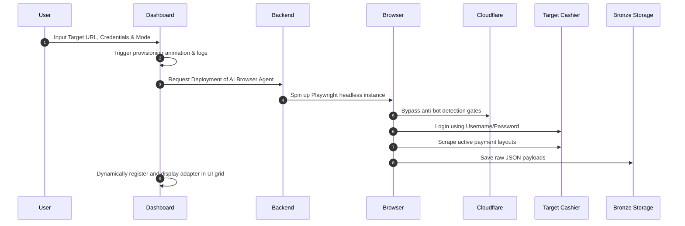

<p align="center">
  
</p>

<h1 align="center">🛡️ SentinelX Trust AI</h1>
<p align="center">
  <b>Multi-Agent AI Data Lakehouse Platform for Betting App Payment Analysis</b>
</p>

<p align="center">
  <a href="https://www.python.org/"></a>
  <a href="https://fastapi.tiangolo.com/"></a>
  <a href="https://spark.apache.org/"></a>
  <a href="https://playwright.dev/"></a>
  <a href="https://www.docker.com/"></a>
  <a href="https://prometheus.io/"></a>
  <a href="LICENSE"></a>
</p>

---

## 📖 Overview
**SentinelX Trust AI** is an enterprise-grade, open-source-ready Multi-Agent AI Data Lakehouse Platform designed for automated browser telemetry acquisition, medallion data lakehouse processing, dynamic risk profiling, and trust score intelligence of betting app payment gateways.

It provides a complete end-to-end framework to:
1. **Scrape** payment endpoints using automated Playwright sessions.
2. **Process** raw data using PySpark into Bronze, Silver, and Gold Medallion Lakehouse structures.
3. **Analyze** risk profiles with Random Forest, Isolation Forest, and K-Means models.
4. **Index & Query** anomalies using Semantic FAISS vector indexes and Retrieval-Augmented Generation (RAG).
5. **Monitor** performance with Grafana dashboards, Prometheus telemetry metrics, and Nginx SSL proxy gateways.

---

## 🏗️ System Architecture & Data Flow



---

## ⚡ Core Platform Capabilities

*   **🛡️ Resilient Browser Scrapers:** Automated sessions built with Playwright and Scrapy. Bypasses cloudflare verification and scans payment gateways dynamically.
*   **🤖 AI Scraper Agent Provisioner:** Modern form interface on the dashboard to deploy new scraper agents on-demand with custom credentials, target URL, and AI navigation models.
*   **📐 Medallion Data Lakehouse:** PySpark & Parquet/Delta Lake pipeline managing **Bronze** (raw ingestion), **Silver** (cleaned and deduplicated payment records), and **Gold** (pre-computed analytics) layers.
*   **🧠 Explainable Risk Scoring Engine:** Rule-based AI evaluates site reliability scores (0-100), risk flags, and confidence ratings, categorizing risks into `LOW`, `MEDIUM`, or `HIGH`.
*   **🔍 Semantic Vector Search & RAG:** Embeddings generated using `all-MiniLM-L6-v2` indexed in a FAISS vector database to answer natural language queries using a local LLM.
*   **⚡ Sub-15ms REST APIs:** FastAPI backend server with JWT, role-based access control (RBAC), and TTL caching delivering rapid responses.
*   **📊 Full-Stack Observability:** Live Next.js dashboard, Grafana metrics dashboards, and Nginx reverse SSL proxies.

---

## 🤖 Smart AI Scraper Agent Workflow

The platform features an **AI Scraper Agent Orchestrator** enabling users to dynamically add new targets to the active ingestion pipeline:



---

## 🚀 Quick Start Guide

The application supports both **Containerized Production** and **Hybrid Development** runtime models.

### Option A: Containerized Production Mode
All services (Database, Backend API, Gateway Proxy, Observability stack) run inside Docker:
```bash
# 1. Start all container services
docker-compose -f deployment/docker-compose.yml up -d --build

# 2. Initialize PostgreSQL schemas metadata
docker-compose -f deployment/docker-compose.yml exec backend python main.py --init-db

# 3. Seed sample transactions & platform analytics records
.\.venv\Scripts\python backend/app/database/seed_db.py
```

### Option B: Hybrid Development Mode (Recommended for testing)
Run PostgreSQL in Docker, while running the Backend API and Next.js Frontend directly on your local host for maximum performance:
```bash
# 1. Start PostgreSQL Database container
docker-compose -f deployment/docker-compose.yml up -d postgres

# 2. Run backend server locally (Listening on http://localhost:8000)
.\.venv\Scripts\python backend/app/server.py

# 3. Launch Frontend console locally (Listening on http://localhost:3000)
cd frontend
npm install
npm run build
npm run start
```

---

## 📊 Core API Endpoints

| Group | Method | Path | Description | Access |
| :--- | :--- | :--- | :--- | :--- |
| **Health** | `GET` | `/api/v1/health` | System health & DB connection status | Public |
| **Auth** | `POST` | `/api/v1/auth/login` | Authenticates credentials & issues JWT | Public |
| **Gold** | `GET` | `/api/v1/gold/platforms` | Search Gold platform trust analytics | Public |
| **Gold** | `GET` | `/api/v1/gold/platforms/{site}` | Get platform trust analytics for site | Public |
| **Gold** | `GET` | `/api/v1/gold/insights` | Pre-computed payment method insights | Public |
| **Search** | `GET` | `/api/v1/search` | Multi-criteria search with trust score filters | Reader |
| **AI** | `POST` | `/api/v1/trust-score` | Calculate Trust Score & rule evaluations | Analyst |
| **AI** | `POST` | `/api/v1/analyze` | Generate AI Risk & Recommendation Report | Analyst |
| **AI** | `POST` | `/api/v1/rag/query` | Provider-agnostic RAG natural language search | Analyst |
| **Telemetry**| `GET` | `/metrics` | Prometheus metrics scraping endpoint | Public |

*   **Host Development Swagger Docs:** [http://localhost:8000/docs](http://localhost:8000/docs)
*   **Secure Gateway Swagger Docs:** [https://localhost/docs](https://localhost/docs)

---

## 🧪 Running the Test Suite

Execute the full suite of unit tests, integration tests, E2E simulations, and benchmark runners:
```bash
python -m unittest backend/tests/test_ai_services.py backend/tests/test_api.py backend/tests/test_full_integration.py backend/tests/run_e2e_simulation.py backend/tests/benchmark_performance.py
```

---

## 👥 Engineering Team & Credits

*   👨‍💻 **Niraj=Kadam** — Senior Backend & AI Engineer
*   👩‍💻 **Niraj-kadam** — Senior Data Engineer
*   👨‍💻 **Niraj_Kadam** — Data Acquisition Engineer
*   👩‍💻 **Niraj@Kadam** — Senior DevOps Engineer
