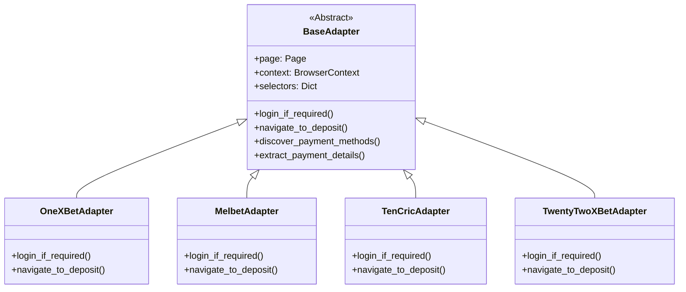
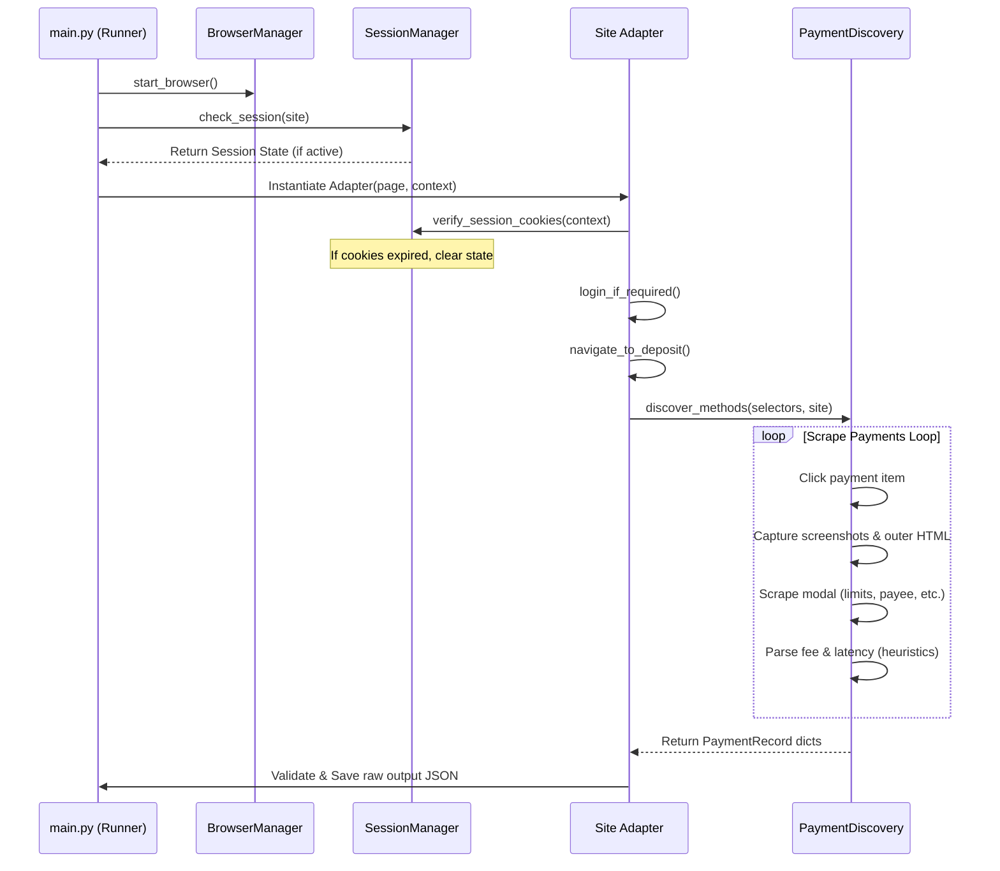

# SentinelX Trust AI – Web Scraping & Data Acquisition Specification

**Version:** 2.0  
**Status:** Approved  
**Author:** Rayri Sharma (Senior Data Acquisition Engineer)  
**Last Updated:** 2026-07-29  

---

## 1. Purpose

This document defines the official design, structure, schemas, and verification rules for the SentinelX Trust AI web scraping and data acquisition engine. 

The goal of the Data Acquisition module is to reliably scrape public payment gateway details (supported providers, transaction limits, processing latency, fees) from digital platform cashiers and structure them into a normalized Pydantic model format matching schema version 1.1 for downstream processing (ETL, lakehouse tiers, AI engine, and APIs).

---

## 2. Platform Architecture & Adapter Hierarchy

The acquisition engine relies on a unified Playwright browser execution context. It uses a factory pattern to resolve target-specific handlers dynamically at runtime:



### 📋 Platform Mappings and Registry Aliases
All concrete adapters are registered inside the centralized `AdapterFactory` mapping registry:
* `"onexbet"`, `"1xbet"`: `OneXBetAdapter`
* `"melbet"`: `MelbetAdapter`
* `"10cric"`, `"tencric"`: `TencricAdapter` (pointing to `TenCricAdapter`)
* `"22xbet"`, `"twentytwobet"`: `TwentyTwoBetAdapter` (pointing to `TwentyTwoXBetAdapter`)

---

## 3. Data Acquisition Workflow

The scraping loop utilizes nested sub-managers to complete authentication, cashier navigation, lazy-load scanning, and detail extraction loops:



---

## 4. Standard Output Schema (Version 1.1)

All scraped options must comply with the `PaymentRecord` schema. Extra metadata elements (processing delays, commissions, payee info) are captured inside the `extracted_data` dictionary block:

```json
{
    "schema_version": "1.1",
    "scraper_version": "1.0.0",
    "source_platform": "onexbet",
    "extraction_status": "success",
    "extraction_method": "playwright_sync",
    "site": "onexbet",
    "page_type": "deposit_page",
    "payment_type": "upi",
    "payment_name": "UPI Fast",
    "currency": "INR",
    "country": "IN",
    "bonus_name": null,
    "support_type": "live_chat",
    "support_value": null,
    "status": "active",
    "source_url": "https://1xlite-12947.pro/en/office/recharge/",
    "scraped_at": "2026-07-29T15:08:35Z",
    "extracted_data": {
        "upi_id": "merchant@bank",
        "bank_account": null,
        "ifsc_code": null,
        "payee_name": "SentinelX Labs Payee",
        "min_deposit": "500",
        "max_deposit": "50000",
        "limit_info": "Min: 500 INR / Max: 50000 INR",
        "processing_time": "Instant",
        "transaction_fee": "Free"
    }
}
```

---

## 5. Ingestion & Validation Standards

The pipeline validation layers enforce the following quality audits prior to Data Lake raw export:
1. **UTF-8 Charset Encoding:** Console logs and JSON dumps must strip non-ascii emoji characters to prevent encoding exceptions on Windows shells.
2. **Schema Compliance:** The exporter verifies records via the `PaymentRecord` Pydantic model. Invalid records fail validation and are skipped.
3. **Data Lake Organization:** Verified outputs are exported directly to historical directories: `data/raw/YYYY-MM-DD/HH-MM/`.