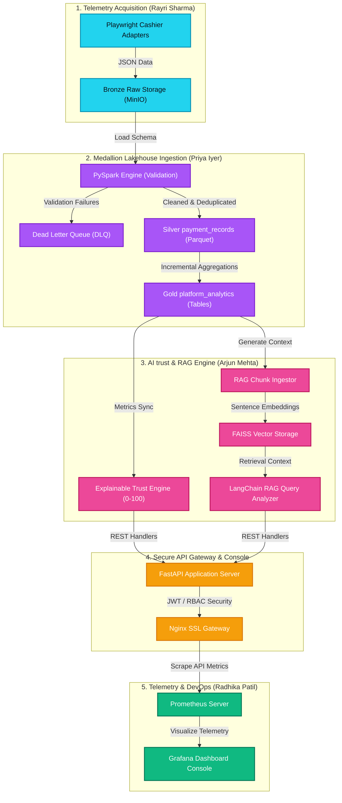

  

<h1 align="center">Documentation Portal — SentinelX Trust AI</h1>

  <b>Comprehensive engineering index, architecture specifications, and operational manuals for the platform.</b>

---

## 🗺️ Modern Platform Architecture Map
The following interactive data flow illustrates the real-time interaction between automated web scrapers, the PySpark Medallion Lakehouse, vector storage, and the FastAPI gateway layer:

---

## 📂 Documentation Directory Index

Select a file link below to read the comprehensive specs, diagrams, and setups for each platform module:

### 📁 Project Governance & Vision
Overview of product definitions, requirements, and compliance metrics:

| Document | Type | Purpose / Description |
| :--- | :---: | :--- |
| **[Product Requirements (PRD)](file:///d:/kadam/Multi-Agent-AI-Data-Lakehouse-Platform-for-Betting-App-Analysis/docs/PRD/PRD.md)** | 📄 Spec | Core product features, user stories, and platform requirements. |
| **[Technical Specifications (TRD)](file:///d:/kadam/Multi-Agent-AI-Data-Lakehouse-Platform-for-Betting-App-Analysis/docs/Architecture/TRD.md)** | 📄 Spec | Technical prerequisites, data structures, and operational boundaries. |
| **[Active Risk Register](file:///d:/kadam/Multi-Agent-AI-Data-Lakehouse-Platform-for-Betting-App-Analysis/docs/Risk%20Register/Risk-Register.md)** | 🛠️ Log | Ongoing assessment of system security, scale, and database risks. |

 

### 📁 System Architecture & Guidelines
Detailed layout directories of database configurations, networks, and coding guidelines:

| Document | Type | Purpose / Description |
| :--- | :---: | :--- |
| **[System Architecture Guide](file:///d:/kadam/Multi-Agent-AI-Data-Lakehouse-Platform-for-Betting-App-Analysis/docs/architecture.md)** | 🆕 Active | Core modular structure, component sequence diagrams, and execution SLAs. |
| **[Database & Lakehouse Schema](file:///d:/kadam/Multi-Agent-AI-Data-Lakehouse-Platform-for-Betting-App-Analysis/docs/database_schema.md)** | 🆕 Active | PostgreSQL ORM schemas, ER diagrams, and Medallion layouts. |
| **[AI & Trust Engine Specs](file:///d:/kadam/Multi-Agent-AI-Data-Lakehouse-Platform-for-Betting-App-Analysis/docs/ai_trust_engine.md)** | 🆕 Active | Math logic formulas, RAG embeddings specs, and TTL caching mechanism. |
| **[Design System Brief](file:///d:/kadam/Multi-Agent-AI-Data-Lakehouse-Platform-for-Betting-App-Analysis/docs/Architecture/Design-System.md)** | 🛠️ Guide | Frontend layout guidelines, theme colors, and style tokens. |
| **[Developer Onboarding Guide](file:///d:/kadam/Multi-Agent-AI-Data-Lakehouse-Platform-for-Betting-App-Analysis/docs/developer_guide.md)** | 🆕 Active | Developer local setup rules, env config, and branching strategies. |

 

### 📁 API & Specifications
Technical specifications for endpoints, caching, and automated cashiers:

| Document | Type | Purpose / Description |
| :--- | :---: | :--- |
| **[REST API Reference Guide](file:///d:/kadam/Multi-Agent-AI-Data-Lakehouse-Platform-for-Betting-App-Analysis/docs/api_reference.md)** | 🆕 Active | OpenAPI routes specs, requests/responses, and authentication levels. |
| **[Medallion ETL Pipeline](file:///d:/kadam/Multi-Agent-AI-Data-Lakehouse-Platform-for-Betting-App-Analysis/docs/etl_pipeline.md)** | 🆕 Active | PySpark data ingestion, schemas, transformations, and output targets. |
| **[Scrapers & Telemetry Guide](file:///d:/kadam/Multi-Agent-AI-Data-Lakehouse-Platform-for-Betting-App-Analysis/docs/scrapers_guide.md)** | 🆕 Active | Playwright headless browser setups, cookies, proxies, and error retries. |

 

### 📁 Sprint Operations & Planning
Operational tracking logs, changes, and audit reports:

| Document | Type | Purpose / Description |
| :--- | :---: | :--- |
| **[Phase 5 Audit Report](file:///d:/kadam/Multi-Agent-AI-Data-Lakehouse-Platform-for-Betting-App-Analysis/docs/audit_report.md)** | 🆕 Active | File audit trace report, inventory maps, and architecture diagrams. |
| **[Implementation Roadmap](file:///d:/kadam/Multi-Agent-AI-Data-Lakehouse-Platform-for-Betting-App-Analysis/docs/Sprint%20Reports/Phases.md)** | 🛠️ Road | Comprehensive sprint breakdown phases from Phase 1 through Phase 10. |
| **[Project Memory log](file:///d:/kadam/Multi-Agent-AI-Data-Lakehouse-Platform-for-Betting-App-Analysis/docs/Sprint%20Reports/Memory.md)** | 🛠️ Log | Living journal tracking key architectural approvals and updates. |
| **[System Changelog](file:///d:/kadam/Multi-Agent-AI-Data-Lakehouse-Platform-for-Betting-App-Analysis/docs/CHANGELOG/CHANGELOG.md)** | 🛠️ Log | Version release tracking history. |

---

## 🛠️ Run Guide Reference
For a complete guide to running the project containers, seeding PostgreSQL, and launching the Next.js frontend, see the master runner handbook:
👉 **[Master Operational RUN_GUIDE.md](file:///d:/kadam/Multi-Agent-AI-Data-Lakehouse-Platform-for-Betting-App-Analysis/RUN_GUIDE.md)**