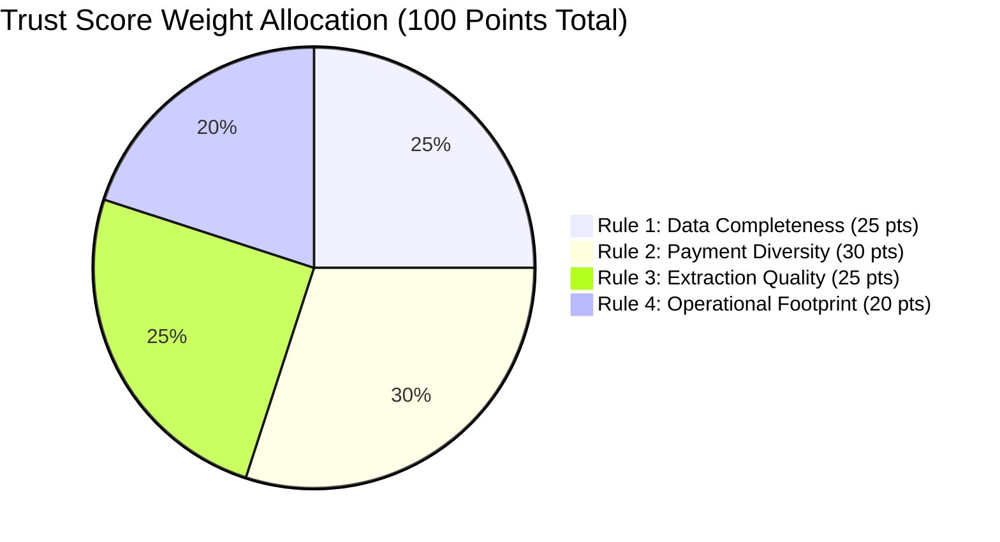

# 🧠 SentinelX Trust AI — AI Intelligence & Trust Engine Guide

**Version:** 1.0.0  
**Engine Type:** Configurable Rule-Based Intelligence & Provider-Agnostic RAG Architecture  

---

## 📐 Trust Score Calculation Methodology

The **SentinelX Trust Engine** computes a deterministic platform trust score between **0.0 and 100.0** based on 4 weighted rule evaluations.



---

## 🛠️ Weighted Scoring Rules

### Rule 1: Data Completeness (Max Weight: 25.0 Points)
Evaluates data volume and presence of required payment parameters (`site`, `payment_type`, `payment_name`, `currency`, `country`).
- **Formula:** `Points = Min(25.0, (RecordCount / 10.0) * 25.0)`

### Rule 2: Payment Method Diversity (Max Weight: 30.0 Points)
Evaluates regional payment options and channel coverage:
- **Distinct Payment Categories:** `Min(12.0, Categories * 4.0)`
- **Distinct Countries Covered:** `Min(10.0, Countries * 5.0)`
- **Distinct Currencies Supported:** `Min(8.0, Currencies * 4.0)`

### Rule 3: Data Extraction Quality (Max Weight: 25.0 Points)
Evaluates ratio of successful scraper extractions versus failures:
- **Formula:** `Points = (SuccessCount / TotalCount) * 25.0`

### Rule 4: Operational Footprint (Max Weight: 20.0 Points)
Evaluates ratio of active payment channels and presence of live customer support protocols (`Live Chat`, `Email`, `Phone`, `Telegram`):
- **Active Channel Ratio:** `Up to 10.0 pts`
- **Customer Support Presence:** `Up to 10.0 pts`

---

## 🚦 Risk Tier Classifications

| Score Range | Risk Level | Description |
| :--- | :--- | :--- |
| **70.0 – 100.0** | `HIGH` | Highly reliable platform with diverse, verified payment options and active support protocols. |
| **40.0 – 69.9** | `MEDIUM` | Moderately reliable platform with standard payment channels but limited regional coverage or missing support metadata. |
| **0.0 – 39.9** | `LOW` | High-risk platform with low record completeness, single payment channel, or high extraction failure rates. |

---

## 🤖 Provider-Agnostic RAG Architecture

The Retrieval-Augmented Generation (RAG) backend retrieves relevant payment records and Gold summaries to assemble LLM-ready prompts:

1. **Document Ingestor (`DocumentIngestor`):** Converts database records and Gold analytics into structured `RAGChunk` objects.
2. **Retrieval Engine (`RetrievalEngine`):** Scores keyword matches, platform domain relevance (+3 match boost), and Gold summaries (+2 boost) to select top-K relevant documents.
3. **Context Builder (`ContextBuilder`):** Assembles retrieved chunks into clean context strings.
4. **Prompt Builder (`PromptBuilder`):** Injects context and user queries into externalized system templates.
5. **Response Formatter (`ResponseFormatter`):** Formats output answer and calculates estimated token counts.

---

## ⚡ Performance Caching (`core/cache.py`)

High-throughput read queries use the `@cache_response(ttl_seconds=60)` decorator backed by `SimpleTTLCache`:

```python
from core.cache import cache_response

@cache_response(ttl_seconds=60)
def fetch_gold_analytics(site: str):
    # Returns cached response in < 1ms on cache hit
```
