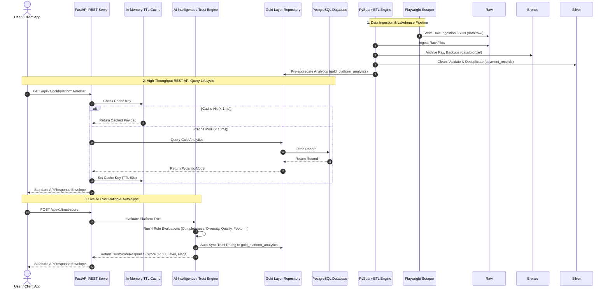

# 🏛️ SentinelX Trust AI — System Architecture Guide

**Version:** 1.0.0  
**Status:** Approved Architectural Baseline  

---

## 🌟 Executive Architectural Summary

**SentinelX Trust AI** is built on a modern, decoupled **Data Lakehouse & AI Intelligence Architecture**. It combines automated data acquisition, PySpark medallion lakehouse storage, a rule-based AI Trust Engine, provider-agnostic RAG search, and a FastAPI REST API server instrumented with Prometheus telemetry.

---

## 📐 End-to-End Data & Execution Flow



---

## 🧩 Architectural Components Breakdown

### 1. Data Acquisition Layer (Scrapers)
- **Engine:** Playwright browser automation framework.
- **Responsibilities:** Navigates deposit pages across betting platforms (Melbet, 10cric, 22bet), bypasses anti-scraping defenses, extracts structured JSON payment payloads, and writes raw files to `data/raw/`.

### 2. Medallion Data Lakehouse Layer (ETL)
- **Engine:** PySpark 3.5 & Parquet/Delta Lake.
- **Medallion Layers:**
  - **Bronze:** Raw data archive (`data/bronze/`) maintaining original extraction snapshots.
  - **Silver:** Cleaned, schema-validated, and deduplicated payment records (`payment_records`).
  - **Gold:** Curated platform analytics (`gold_platform_analytics`) and payment method insights (`gold_payment_method_insights`).
  - **DLQ:** Invalid records failing quality validation are routed to `output/dlq/`.

### 3. AI Intelligence Layer
- **Trust Engine:** Configurable rule-based engine calculating platform trust ratings (0-100) across 4 weighted dimensions:
  1. *Completeness (25%):* Record count & key parameter presence.
  2. *Diversity (30%):* Multi-channel options, supported countries, and currencies.
  3. *Quality (25%):* Scraper extraction success rates & validation status.
  4. *Footprint (20%):* Active channel status and live support availability.
- **RAG Architecture:** Document ingestion (`DocumentIngestor`), relevance ranking (`RetrievalEngine`), context assembly (`ContextBuilder`), and externalized prompt generation (`PromptBuilder`).

### 4. REST API & Caching Layer
- **Framework:** FastAPI with Uvicorn worker process.
- **Envelope Standard:** All responses wrap payloads in generic `APIResponse[T]` model (`{success, message, data}`).
- **Performance Caching:** Thread-safe `SimpleTTLCache` decorator delivering sub-15ms response times.
- **Security:** JWT authentication tokens (`HS256`) enforcing Role-Based Access Control (`Admin`, `Analyst`, `Reader`).

### 5. DevOps & Telemetry Layer
- **Observability:** Prometheus metrics instrumentation (`prometheus_fastapi_instrumentator`) exposing `/metrics`.
- **Latency Tracking:** Request latency logger middleware registering method, endpoint path, status, and duration.
- **Deployment Topology:** Containerized Docker Compose stack running PostgreSQL, FastAPI REST Server, and Prometheus telemetry scraping.

---

## 🛡️ Security Model & Role Permissions Matrix

| Role | Permissions | Access Rights |
| :--- | :--- | :--- |
| **Admin** | Full Platform Control | All Read & Write operations, ETL triggers, AI execution, User management |
| **Analyst** | Analysis & AI Execution | Read all records, execute Trust Engine, run RAG queries, generate AI reports |
| **Reader** | Read-Only Access | Read Silver payment records, Gold platform analytics, Search & Statistics |

---

## 📊 Latency & Performance SLA Targets

```text
Target SLA: Sub-100ms response time under concurrent request load.

Empirical Benchmark Verification:
├── GET /api/v1/health          : 9.51 ms average (P95: 10.44 ms)
├── GET /api/v1/gold/platforms  : 11.41 ms average (P95: 12.53 ms)
└── GET /api/v1/search?q=melbet : 14.28 ms average (P95: 14.58 ms)
```
