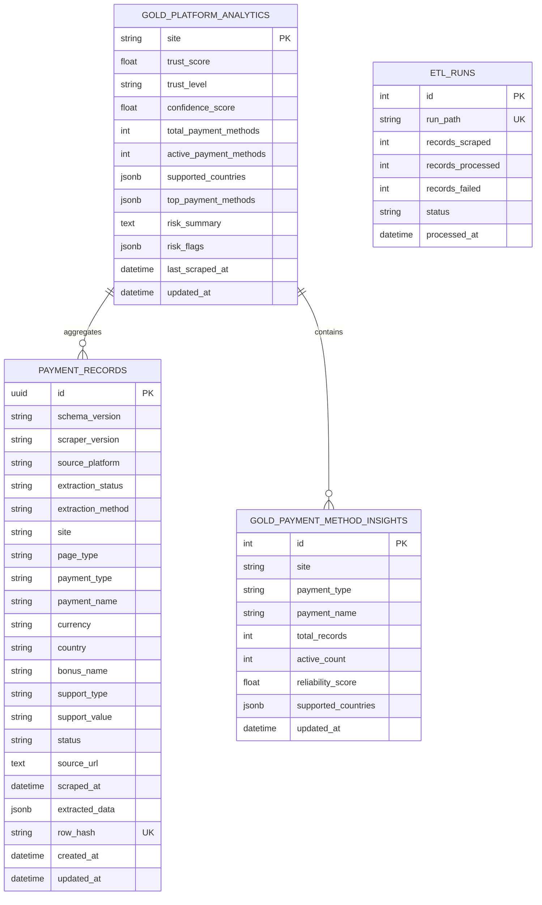

# 🗄️ SentinelX Trust AI — Database & Lakehouse Schema Guide

**Version:** 1.0.0  
**Storage Stack:** PostgreSQL 15+ & PySpark Parquet Lakehouse  

---

## 📊 PostgreSQL Relational Schema & ER Diagram



---

## 🏛️ Medallion Data Lakehouse Layers

```text
/data
├── raw/       # Unprocessed Scraper JSON Outputs (Source Ingestion)
├── bronze/    # Raw Parquet Archives (Backups with Ingestion Metadata)
├── silver/    # Cleaned, Normalized & Deduplicated Records (payment_records)
└── gold/      # Pre-aggregated Platform Analytics & Trust Metrics
```

### 🥉 Bronze Layer (`data/bronze/`)
- **Format:** Parquet / Raw JSON Archive.
- **Description:** Preserves immutable raw extraction snapshots from Playwright scrapers with added `ingested_at` timestamps.

### 🥈 Silver Layer (`payment_records`)
- **Table Name:** `payment_records`
- **Description:** Schema-validated, standardized, and deduplicated payment records. Unique constraint enforced via `row_hash` SHA-256 hash.

### 🥇 Gold Layer (`gold_platform_analytics` & `gold_payment_method_insights`)
- **Table Names:** `gold_platform_analytics` and `gold_payment_method_insights`.
- **Description:** Pre-computed analytics summaries enabling sub-15ms API response latencies for trust scores, regional coverage, and channel reliability metrics.

---

## 🚫 Dead Letter Queue (`output/dlq/`)

Records failing validation during PySpark ETL processing (missing mandatory fields, invalid currency format, or unparseable JSON) are isolated into `output/dlq/invalid_records.json` alongside error reason metadata for auditing.
