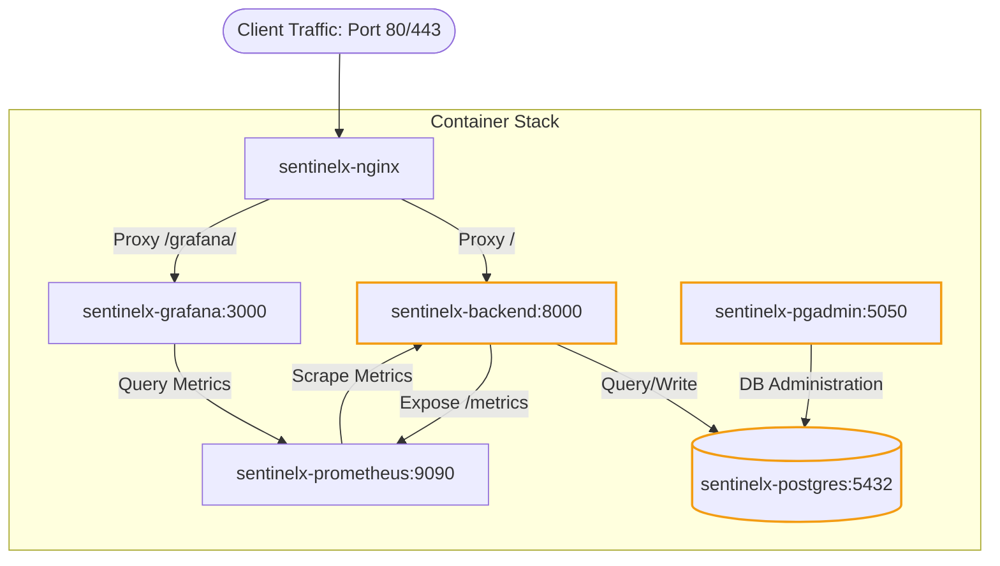

# 🐳 SentinelX Trust AI — DevOps, Telemetry & Operations Runbook

**Version:** 1.0.0  
**Status:** Approved Operations Runbook  
**Author:** Radhika Patil (Senior DevOps Engineer)  
**Last Updated:** 2026-08-02  

---

## 1. 🐳 Containerized Production Topology

The platform orchestrates six interconnected container services within a secure bridge network (`sentinelx-network`):



---

## 2. 🛡️ Local Loopback Port Hardening

To prevent raw socket exposure and unauthorized DB probing on production interfaces, public ports are bound strictly to `127.0.0.1`. All external access is routed through the Nginx gateway reverse proxy:

| Service Name | Container Name | Internal Port | Host Binding | External Accessibility |
| :--- | :--- | :---: | :---: | :--- |
| **Nginx (Proxy)** | `sentinelx-nginx` | `80`, `443` | `0.0.0.0:80`, `0.0.0.0:443` | **Public** (HTTP/HTTPS) |
| **PostgreSQL** | `sentinelx-postgres` | `5432` | `127.0.0.1:5432` | Local Host Only |
| **pgAdmin** | `sentinelx-pgadmin` | `80` | `127.0.0.1:5050` | Local Host Only |
| **FastAPI Backend**| `sentinelx-backend` | `8000` | `127.0.0.1:8000` | Local Host Only |
| **Prometheus** | `sentinelx-prometheus`| `9090` | None | Internal Network Only |
| **Grafana** | `sentinelx-grafana` | `3000` | None | Proxied via `/grafana/` |

---

## 📊 3. Observability & Prometheus Instrumentation

Uvicorn and FastAPI expose telemetry data using `prometheus_fastapi_instrumentator`:

*   **Scrape Endpoint:** `http://localhost:8000/metrics` (or `https://localhost/metrics` via proxy)
*   **Active Metrics Monitored:**
    - `http_requests_total`: Counts requests categorized by HTTP method, router path, and status code.
    - `http_request_duration_seconds`: Response latency histogram (essential for SLA validation).
    - `process_cpu_seconds_total` & `process_virtual_memory_bytes`: Core hardware usage footprints.

---

## 💾 4. Database Backup & Disaster Recovery Runbook

To guarantee data persistence and audit capability, backup scripts are version-controlled in the repository.

### A. Run Database Backup (pg_dump)
Execute a dump of the active database snapshot to a compressed SQL file:
```bash
docker exec -t sentinelx-postgres pg_dump -U postgres sentinelx_trust_ai > ./backups/sentinelx_db_backup.sql
```

### B. Restore Database (pg_restore / psql)
1. Terminate existing database connection handles first to avoid lock table conflicts:
   ```bash
   docker exec -t sentinelx-postgres psql -U postgres -c "SELECT pg_terminate_backend(pid) FROM pg_stat_activity WHERE datname = 'sentinelx_trust_ai';"
   ```
2. Stream the backup file back into the container:
   ```bash
   docker exec -i sentinelx-postgres psql -U postgres -d sentinelx_trust_ai < ./backups/sentinelx_db_backup.sql
   ```

### C. Backup Verification Script ([backup_verify.sh](file:///d:/kadam/Multi-Agent-AI-Data-Lakehouse-Platform-for-Betting-App-Analysis/deployment/scripts/backup_verify.sh))
The DevOps team has automated backup verification. The script:
1. Backs up the live database container.
2. Spawns a temporary isolated validation database container.
3. Restores the backup snapshot and queries tables count (`information_schema.tables`) to assert snapshot integrity.

To execute the verification locally:
```bash
bash deployment/scripts/backup_verify.sh
```
