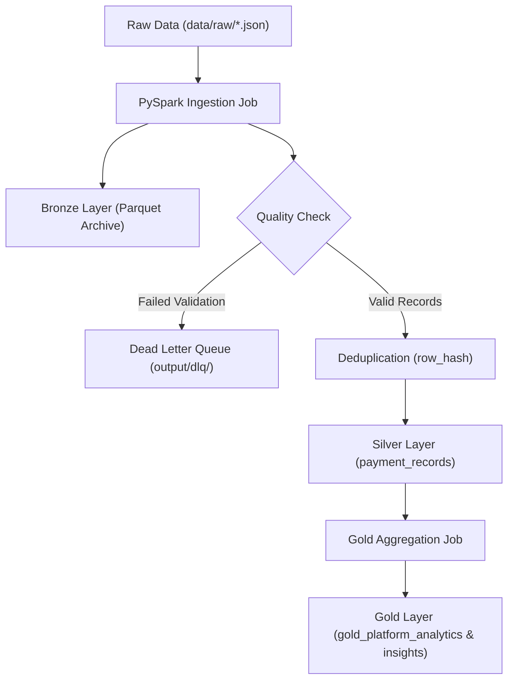

# ⚙️ SentinelX Trust AI — Medallion Lakehouse ETL Pipeline Guide

**Version:** 1.0.0  
**Processing Engine:** PySpark 3.5 & Parquet Lakehouse Storage  

---

## 📐 Medallion Data Lakehouse Architecture

---

## 🔄 Lakehouse Transformations & Quality Rules

### 1. Bronze Layer (Raw Archive)
- Archives raw scraper payloads into immutable Parquet partitions with added `ingested_at` metadata timestamps.

### 2. Silver Layer (Cleaned & Deduplicated)
- Standardizes country ISO codes (e.g. `IN`, `BR`).
- Normalizes payment categories (`e-wallet`, `bank_transfer`, `crypto`).
- Generates SHA-256 `row_hash` across key parameters (`site`, `payment_type`, `payment_name`, `country`, `currency`) to prevent duplicate record insertion.

### 3. Gold Layer (Curated Analytics)
- Aggregates platform summaries (`total_payment_methods`, `active_payment_methods`, `supported_countries`, `top_payment_methods`).
- Computes baseline reliability metrics per payment method channel.

### 4. Dead Letter Queue (DLQ)
- Invalid records missing mandatory fields (`site`, `payment_name`) are isolated into `output/dlq/invalid_records.json` for audit review.
