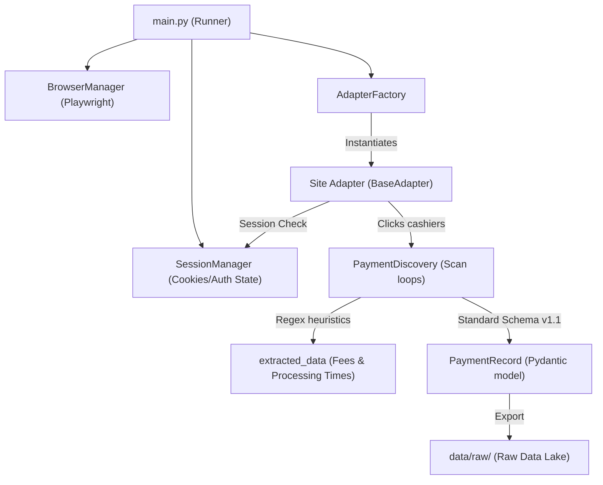

# 🕷️ SentinelX Trust AI — Data Acquisition & Scraper Guide

**Version:** 1.0.0  
**Status:** Approved Documentation Baseline  
**Author:** Niraj Kadam (Senior Data Acquisition Engineer)  
**Last Updated:** 2026-07-29  

---

## 📐 Scraper Architecture

The **Data Acquisition Module** employs a unified, modular Playwright browser automation context. Site-specific behaviors are delegated to concrete adapter subclasses resolved dynamically by the factory registry:

---

## 🛠️ Supported Platform Adapters & Mappings

The registry mappings inside `AdapterFactory` support both primary and alias site name strings to ensure full backward compatibility with ETL and backend ingestion engines:

| Website Name | Target Class | Registry Key Aliases | default cashiers Entry URL |
| :--- | :--- | :--- | :--- |
| **OneXBet** | `OneXBetAdapter` | `"onexbet"`, `"1xbet"` | `https://1xlite-12947.pro/en/office/recharge/` |
| **Melbet** | `MelbetAdapter` | `"melbet"` | `https://melbet.mobi/en/office/recharge/` |
| **Tencric** | `TencricAdapter` | `"tencric"`, `"10cric"` | `https://10cric247.com/deposit/` |
| **TwentyTwoBet**| `TwentyTwoBetAdapter`| `"twentytwobet"`, `"twentytwoxbet"`, `"22xbet"` | `https://22play.com/office/recharge/` |

---

## 🛡️ Operational Reliability & Session Auditing

The scrapers are hardened for production deployments using the following features:

### 1. Context Session Auditing & Cleanup
* **verify_session_cookies:** Prior to cashier navigation, the adapter audits stored session cookies in the browser context to verify their expiration epochs.
* **Stale state Cleanup:** If cookies fail validation or a login form trigger button is visible, the adapter automatically invokes `clear_session()` and triggers automated/manual login fallback flows.
* **Audit Traces:** Distinct lifecycle logs are written: `[Session Audit] Session reused successfully`, `[Session Audit] Session expired. Page requires re-authentication`, and `[Session Audit] New login performed`.

### 2. Configurable Timeouts & Connection Diagnostics
* Default navigation interactions wait for 20 seconds.
* Errors are caught and parsed by `_diagnose_navigation_error()` to output distinct warnings:
  - `[DNS FAILURE]`: Hostname resolution failed (`ERR_NAME_NOT_RESOLVED`).
  - `[TIMEOUT]`: Target server offline or blocking requests (`ERR_CONNECTION_TIMED_OUT`).
  - `[CONNECTION REFUSED]`: Connection rejected by server (`ERR_CONNECTION_REFUSED`).

### 3. Strict Mode Locator Protection
* All fill and click actions use the `.first` locator modifier. This prevents strict mode violations on platforms containing duplicate input names or search textboxes (e.g. search fields mapping to username inputs).

### 4. Exponential Backoff Retries
* Critical network interactions are wrapped inside the centralized `retry_operation` utility (default 3 retries with delay backoffs), catching and recovering from transient network load spikes automatically.

---

## 📊 Extracted Schema Specifications (v1.1)

All discovered options are exported as a validated `PaymentRecord` JSON file:
* **payment_type:** Mapped automatically based on provider labels (`upi`, `net_banking`, `bank_transfer`, `cryptocurrency`, `e-wallet`).
* **status:** Set to `"inactive"` if indicators like `"maintenance"`, `"unavailable"`, or `"disabled"` are matched inside the payment grid card text.
* **extracted_data:** Capture fields extracted via modal scraping or regex body scanning:
  - `processing_time`: Mapped to dynamic intervals (e.g. `"Instant"`, `"15 minutes"`, `"1-3 days"`).
  - `transaction_fee`: Configured dynamically (e.g. `"Free"`, `"0.5% commission"`).
  - Limits details (`min_deposit`, `max_deposit`, and raw `limit_info`).
