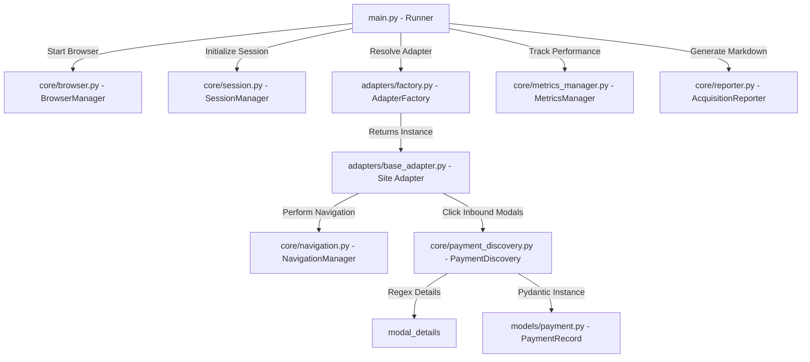

# SentinelX Trust AI – Data Acquisition & Scraper Module

**Author:** Rayri Sharma (Senior Data Acquisition Engineer)  
**Version:** 1.0.0  
**Last Updated:** 2026-07-29  

---

## 🌐 Module Overview

The **Data Acquisition Module** is a high-performance web scraping and browser automation system built using **Playwright**. It is designed to navigate public cashiers of betting platforms, authenticate (or handle manual interventions), discover available payment options, extract transactional parameters (UPI IDs, bank details, fees, limit ranges, latency metrics), and export structured JSON data matching schema contract version 1.1.

---

## 🏗 Component Architecture & Layout

The module is organized using a clean, layered monolithic layout:



### 📂 Directory Structure Layout
```text
scraper/
├── requirements.txt            # Python dependencies (Playwright, Pydantic, etc.)
├── run_tests.py                 # Central unit test suite runner script
├── tests/                       # Unit tests suite directory
│   ├── test_adapter_factory.py  # Tests factory resolution and aliases
│   ├── test_browser.py          # Tests BrowserManager startups
│   ├── test_exporter.py         # Tests JSON file creations
│   ├── test_json_schema.py      # Tests model schema validations
│   ├── test_navigation.py       # Tests NavigationManager loads
│   ├── test_payment_discovery.py# Tests regex detail parser rules
│   ├── test_selectors.py        # Tests configuration selectors structure
│   └── test_session.py          # Tests SessionManager state cycles
└── scraper/                     # Core source directory
    ├── main.py                  # CLI executable pipeline runner entrypoint
    ├── scheduler.py             # Periodic background cron scheduler execution
    ├── adapters/                # Platform specific browser adapters
    │   ├── base_adapter.py      # Abstract interface and shared actions
    │   ├── factory.py           # Site name resolver registry
    │   ├── melbet/              # Melbet adapter module
    │   ├── onexbet/             # OneXBet adapter module
    │   ├── tencric/             # TenCric adapter module
    │   └── twentytwoxbet/       # TwentyTwoXBet adapter module
    ├── config/                  # Configuration layers
    │   ├── settings.py          # Central environment loading variables
    │   └── selectors/           # Platform CSS element paths selector maps
    ├── core/                    # Core browser automation engines
    │   ├── browser.py           # Browser context launcher wrapper
    │   ├── login.py             # Form authenticator with headed manual fallback
    │   ├── metrics_manager.py   # Historical metrics logs and monthly rotations
    │   ├── navigation.py        # Configurable timeouts and diagnostics wrapper
    │   ├── payment_discovery.py # Click-through modal sweeps scanner
    │   ├── reporter.py          # Markdown stats and data quality reports generator
    │   ├── retry_utils.py       # Central backoff exponential retry utility
    │   └── session.py           # Cookie validity and context file manager
    └── models/                  # Pydantic data schemas
        └── payment.py           # Ingestion contract schema model (v1.1)
```

---

## ⚙️ Configuration & Environment Variables

The module loads settings from `.env` located at the root of the workspace.

| Parameter Name | Type | Default Value | Description |
|---|---|---|---|
| `HEADLESS` | Boolean | `False` | Run browser process in headless or headed mode. |
| `WAIT_TIMEOUT` | Integer | `20` | Default timeout in seconds for page interaction wait states. |
| `USERNAME` | String | `""` | User credentials for platform cashier login. |
| `PASSWORD` | String | `""` | User password for platform cashier login. |
| `ONEXBET_URL` | String | `""` | cashier target URL for OneXBet. |
| `MELBET_URL` | String | `""` | cashier target URL for Melbet. |
| `TENCRIC_URL` | String | `""` | cashier target URL for Tencric. |
| `PLAY22_URL` | String | `""` | cashier target URL for TwentyTwoBet. |

---

## 🚀 Execution & Operational Commands

### 1. Execute Multi-Site Ingestion
To scrape and validate payments across all registered platforms:
```bash
python scraper/main.py --site all
```

To run a single platform (including naming aliases):
```bash
python scraper/main.py --site tencric
```

### 2. Run Periodic Scheduler (Cron)
To run the background scheduler daemon that triggers scraping runs periodically:
```bash
python scraper/scheduler.py
```

### 3. Execute Unit Test Suite
To run the automated Python test suite:
```bash
python run_tests.py
```

---

## 🏥 Telemetry & System Health

The metrics pipeline generates operational reports post-run under `output/reports/YYYY-MM-DD/HH-MM/`:
* **dataset_stats_report.md:** Includes a System Health Dashboard, Success Rate trend graphs, durations curve, and execution diagnostics.
* **data_quality_report.md:** Audits Pydantic validations, UTF-8 charsets, coordinate completeness index, and duplicated items matching.
* **Metrics Archiving:** Execution entries are appended to `data/metrics/historical_metrics.json`. The module performs database rotation automatically on monthly boundaries.
